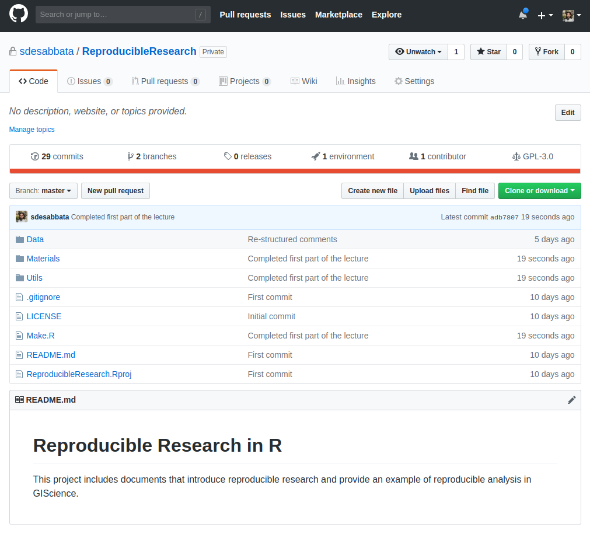

```{r setup, include=FALSE}
knitr::opts_chunk$set(echo = FALSE)
```


## Today's topics

- What is reproducible research?
    - why is it important?
    - software engineering
    - in GIScience
    - practical principles
- How to do reproducible research in R
    - Markdown
    - *knitr* and *rmarkdown*

Reference book: [Christopher Gandrud, *Reproducible Research with R and R Studio*](https://www.crcpress.com/Reproducible-Research-with-R-and-R-Studio/Gandrud/p/book/9781498715379) also available [on GitHub](https://github.com/christophergandrud/Rep-Res-Book)


## What is reproducible research?

In quantitative research, an analysis or project are considered to be **reproducible** if:

- *"the data and code used to make a finding are available and they are sufficient for an independent researcher to recreate the finding."* [Christopher Gandrud, *Reproducible Research with R and R Studio*](https://www.crcpress.com/Reproducible-Research-with-R-and-R-Studio/Gandrud/p/book/9781498715379)

That is becoming more and more important in science:

- as programming and scripting are becoming integral in most disciplines
- as the amount of data increases


## Why?

In **scientific research**:

- verificability of claims through replication
- incremental work, avoid duplication

For your **working practice**:

- better working practices
    - coding
    - project structure
    - versioning
- better teamwork
- higher impact (not just results, but code, data, etc.)


## Reproducibility and software engineering

Core aspects of **software engineering** are:

- project design
- software **readibility**
- testing
- **versioning**

As programming becomes integral to research, similar necessities arise among scientists and data analysts.


## Reproducibility and "big data"

There has been a lot of discussions about **"big data"**...

- volume, velocity, variety, ...

Beyond the hype of the moment, as the **amount** and **complexity** of data increases

- the time required to replicate an analysis using point-and-click software becomes unsustainable
- room for error increases

Workflow management software (e.g., ArcGIS ModelBuilder) is one answer, reproducible research based on script languages like R is another.


## Reproducibility in GIScience

[Singleton *et al.*](https://www.tandfonline.com/doi/abs/10.1080/13658816.2015.1137579) have discussed the issue of reproducibility in GIScience, identifying the following best practices:

1. Data should be accessible within the public domain and available to researchers.
2. Software used should have open code and be scrutable.
3. Workflows should be public and link data, software, methods of analysis and presentation with discursive narrative
4. The peer review process and academic publishing should require submission of a workflow model and ideally open archiving of those materials necessary for
replication.
5. Where full reproducibility is not possible (commercial software or sensitive data) aim to adopt aspects attainable within circumstances


# Five practical tips for reproducible research


## (1) Document everything!

In order to be reproducible, every step of your project should be documented in detail

- data gathering
- data analysis
- results presentation

Well documented R scripts are and excellent way to document your project. 


## (1) Document everything!

The *sessionInfo* function can be used to print a record of all loaded packages and versions.

```{r, echo=TRUE}
sessionInfo()
```


## (2) Everything is a (text) file

Complex formats (e.g., .docx, .xlsx, .shp, ArcGIS .mxd)

- can become obsolete
- are not always portable
- usually require propetary software

Use the simplest format to **future-proof** your analysis.<br/>**Text files** are the most versatile

- data: .txt, .csv, .tsv
- analysis: R scrpts, python scripts
- write-up: LaTeX, Markdown, HTML


## (3) All files should be human readable

Create code that can be **easily understandable** to someone outside your project, including yourself in six-month time!

- use a style guide (e.g. [tidyverse](http://style.tidyverse.org/)) consistently
- add a comment at the beginning of a file, including
    - date
    - contributors
    - other files the current file depends on
    - materials, sources and other references 
- add a comment before each code block, describing what the code does
- also add a comment before any line that could be ambiguous or particulary difficult or important


## (4) Explicitly tie your files together

Relationships between files in a project is not simple:

- in which order are file executed?
- when to copy file from one folder to another, and where?

A common solution are **make files**

- commonly written in *bash* on Linux systems
- they can be written in R, using commands like
    - *source* to execute R scripts
    - *system* to interact with the operative system


## (4) Explicitly tie your files together

Example: *Make.R*

```{r, code=readLines('../../Make.R'), echo=TRUE, eval=FALSE}
```


## (5) Organize, store, share

Reproducible research is particularly important when working in teams and to share and communicate your work.

- [Dropbox](https://www.dropbox.com)
    - good option to work in teams, initially free
    - no versioning, branches
- [Git](https://git-scm.com)
    - free and opensource control system
    - great to work in teams and share your work publically
    - can be more difficult at first
    - [GitHub](https://github.com) public repositories are free, private ones are not
    - [Bitbucket](https://bitbucket.org) offers free private repositories


## (5) Organize, store, share

My GitHub repository [Reproducible research with R](https://sdesabbata.github.io/ReproducibleResearch/) stores this week's lecture and practical session materials.

<div class="img50">

{width=30%}

<center>
<font size="4">
<a href="https://sdesabbata.github.io/ReproducibleResearch/">https://sdesabbata.github.io/ReproducibleResearch/</a>
</font>
<center>

<div>


# R and Markdown

## Markdown

**Markdown** is a simple markup language

- allows to mark-up plain text 
- to specify more complex features (such as *italics text*)
- using a very simple [syntax](https://daringfireball.net/projects/markdown/syntax)

Markdown can be used in conjunction with numerous tools

- to produce HTML pages
- or even more complex formats (such as PDF)

These slides are written in Markdown


## Markdown example code

```
### This is a third level heading

Text can be specified as *italic* or **bold**

- and list can be created
    - very simply

1. also numberd lists
    1. [add a link like this](http://le.ac.uk)

|Tables |Can         |Be       |
|-------|------------|---------|
|a bit  |complicated |at first |
|but    |it gets     |easier   |
```


## Markdown example output

### This is a third level heading

Text can be specified as *italic* or **bold**

- and list can be created
    - very simply

1. also numberd lists
    1. [add a link like this](http://le.ac.uk)

|Tables |Can         |Be       |
|-------|------------|---------|
|a bit  |complicated |at first |
|but    |it gets     |easier   |


## RMarkdown

Markdown can be used in combination with R to dynamically create documents incorporating code and outcomes

Two R libraries:

- **knitr**
    - Markdown (or LaTeX) with R snippets as input
    - compiles it into HTML (or PDF)
- **rmarkdown**
    - uses knitr and pandoc
    - to output files in different formats

## R libraries

As mentioned in earlier lectures, libraries are collections of functions

Libraries can be installed in R using the function *install.packages* and loaded using the function *library*, as shown below (note the use of quote for the first and lack thereof in the second)

```{r, echo=TRUE, eval=FALSE}
install.packages("knitr")
library(knitr)
```

Once a library is installed on a computer you don't need to install it again, but every script needs to load all the library that it uses.

Once a library is loaded all its functions can be used.


## RMarkdown example code

````
Let's write an example of **RMarkdown** including 

- an *if-else* conditional statement
- a *for* loop

`r ''````{r, echo=TRUE}
for (i in 1:4) {
    if (i %% 2 == 0){
        cat("even \n")
    } else {
        cat("odd \n")
    }
}
`r ''````
````


## RMarkdown example output

Let's write an example of **RMarkdown** including 

- an *if-else* conditional statement
- a *for* loop

```{r, echo=TRUE}
for (i in 1:4) {
    if (i %% 2 == 0){
        cat("even \n")
    } else {
        cat("odd \n")
    }
}
```


## RMarkdown example

The *knitr* library also includes very useful functions such as *kable* that formats a *data.frame* object to be displayed using Markdown

```{r, echo=TRUE}
library(knitr)
coverage_data <- read.csv("../../Data/ofcom_mobile_coverage_2012.csv")
kable(head(coverage_data[, 1:4], n=3))

```


## Practical session

In the practical session we will see:

- R and Markdown
    - how to create R Markdown files
    - that can be compiled in
        - HTML
        - PDF
        - Microsoft Word
- how to work with internet data
    - direct access to data
    - downloading files
    - working with APIs